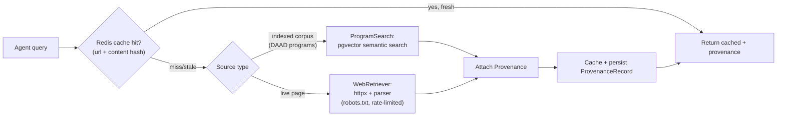

# ADR-0003 — RAG & Grounding Contract

- **Status:** Accepted (Phase 1)
- **Date:** 2026-06-18
- **Deciders:** Lead architect (DeutschPrep)
- **Related:** `agent-workflows.md` §7–§10, ADR-0001, ADR-0002

## Context

The product's credibility depends on **never fabricating official facts** (`CLAUDE.md` §2). Visa
rules, deadlines, tuition & *Semesterbeitrag*, *Sperrkonto* amounts, APS requirements, and language
thresholds must come from a retrieved, cited source — or be returned as `null` with
`needs_verification=true`. This ADR fixes the grounding contract, the retrieval architecture, and how
provenance is captured, stored, and refreshed.

## Decision

### 1. Grounding contract (binding)

Every official fact is represented as:

```python
class Provenance(BaseModel):
    source_name: str          # e.g. "DAAD", "Uni-Assist", "Auswärtiges Amt"
    source_url: HttpUrl
    retrieved_at: datetime

class OfficialValue(BaseModel, Generic[T]):
    value: T | None
    provenance: Provenance | None
    needs_verification: bool = False
```

Rules:
- A non-null official `value` **must** carry `provenance`. Validator rejects otherwise.
- No grounded source → `value=null, needs_verification=true`. **Never a guess.**
- Generated content (SOP prose, lesson plans) is **not** an official fact and needs no provenance,
  but must be labeled generated.
- Numbers are produced by **deterministic services**, not RAG and not the model (see ADR-0001).

### 2. Retrieval architecture



- **ProgramSearch (RAG):** semantic search over the DAAD/program corpus embedded in **pgvector**.
  Used for course/university/scholarship matching (features 3, 20).
- **WebRetriever:** cached, cited live retrieval for facts not in the corpus (visa, Sperrkonto,
  insurance, tickets). Respects `robots.txt` and rate limits; prefers official/open data over HTML.
- **Cache:** Redis keyed by `source_url + content_hash`; TTL per source class (deadlines short,
  static guides longer). Detailed refresh design in `data-pipeline.md` (Phase 2).

### 3. Provenance persistence

- Every official value persisted links a `ProvenanceRecord` row (`data-model.md`, Phase 2).
- Scrapers write a `ProvenanceRecord` per normalized row (`scrapers/*`); none persisted unsourced.
- `retrieved_at` enables staleness checks and incremental refresh.

### 4. Guardrail integration

The grounding check is **stage 2** of the guardrail layer (`agent-workflows.md` §10): any official
claim lacking provenance is coerced to `needs_verification`, surfaced with a UI badge + disclaimer —
never silently dropped.

## Consequences

**Positive**
- Single, enforceable contract for "is this fact trustworthy?" across all 6 agents.
- pgvector co-locates embeddings with relational data → transactional provenance, simpler ops.
- Staleness/refresh become tractable via `retrieved_at` + content hashing.

**Negative / trade-offs**
- Strict grounding means more `needs_verification` results early (before the corpus is rich) — this
  is intentional and honest; the UI must make it clear and actionable.
- Live retrieval adds latency; mitigated by cache-first + async generation + SSE progress.

## Resolved — Embedding model (2026-06-18)

**Decision: `BAAI/bge-m3`, served locally behind an `EmbeddingProvider` interface.**

| Criterion | bge-m3 (chosen) | NV-Embed-v2 (rejected) |
|---|---|---|
| License | **MIT** — commercial OK | `cc-by-nc-4.0` — **non-commercial; cannot ship** |
| Languages | **Multilingual** (German + English) | English-only — poor fit for German corpus |
| Dimensions | **1024** — fits pgvector index limits | 4096 — exceeds pgvector index limit (2000 `vector` / 4000 `halfvec`) |
| Size | ~568M params — runs + fine-tunes on a 16 GB GPU | 8B params — inference needs 4-bit quant on 16 GB; fine-tune marginal |
| Retrieval | Strong MTEB retrieval; dense + sparse + multi-vector | #1 MTEB, but on **English** tasks |

Rationale: DeutschPrep is commercial and its corpus is German-heavy, so license and
multilinguality dominate. bge-m3's 1024-dim dense vectors index cleanly in pgvector (cosine), and
its size makes local serving and fine-tuning feasible on the available RTX 4090 (16 GB).

**Interface contract.** All embedding access goes through `EmbeddingProvider`
(`backend/app/services/embeddings/provider.py`) — mirrors the `LLMProvider`/`TTSProvider` pattern —
so the model stays swappable. The pgvector column dimension is pinned to the provider's
`dimension` (1024) and asserted at startup.

**Fine-tuning.** Harness built now (`backend/app/services/finetune/`); the real training run uses
`(query, positive, hard-negative)` triples derived from the Phase 2 DAAD corpus. See
`data-pipeline.md` (Phase 2) for how hard negatives will be mined.

**Anthropic-native embeddings** were considered and deferred: availability/pricing unconfirmed, and
a self-hosted multilingual model removes a per-call cost and a PII round-trip for the corpus.
