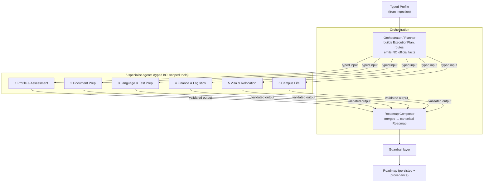
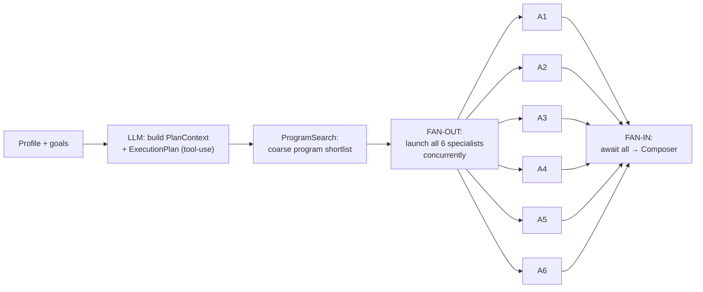
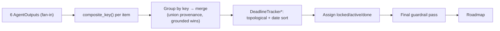
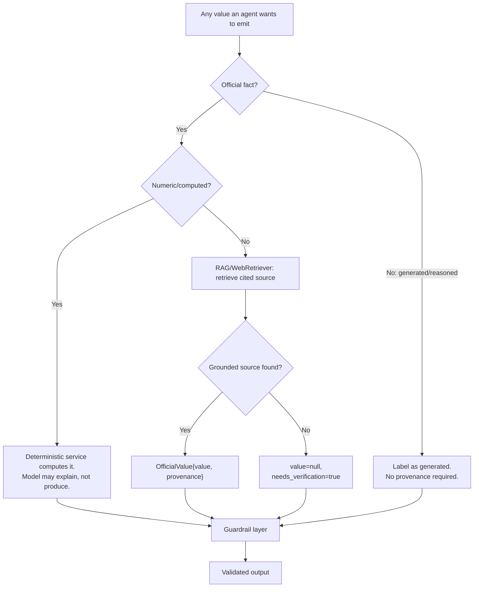
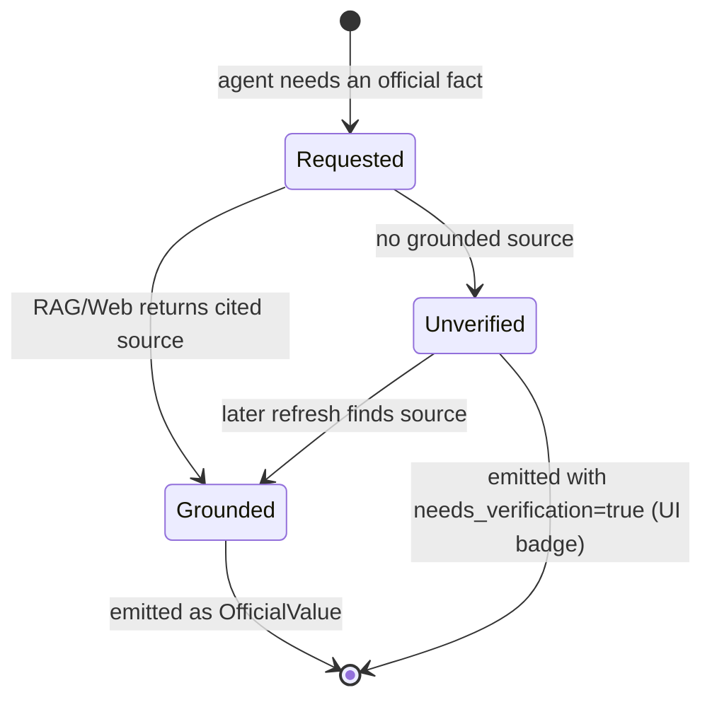
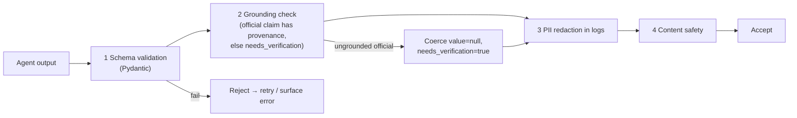

# DeutschPrep — Agent Workflows

> Phase 1 design doc. Defines the Orchestrator/Planner, the 6 specialist agents, the Roadmap
> Composer, and the anti-hallucination strategy. Pydantic sketches are **illustrative contracts**,
> not final code (that lands in Phase 4). Conforms to `CLAUDE.md` §4.

---

## 0. Design principles (binding)

1. **One responsibility per agent.** Each specialist owns a fixed feature set (`CLAUDE.md` §4 table).
2. **Typed I/O only.** Every agent takes a Pydantic model in, returns a Pydantic model out. No
   free-form text crosses an agent boundary (`CLAUDE.md` §2 rule 6).
3. **Scoped tools.** An agent may call *only* its declared tools. The orchestrator cannot call
   official-fact tools directly; specialists cannot call each other.
4. **Grounding requirement.** Every official fact = `{ value, source_name, source_url, retrieved_at }`.
   Ungrounded official claims → `value=null, needs_verification=true`. Never a guess.
5. **LLM writes, code computes.** All arithmetic (GPA, ECTS, cost, deadlines) is delegated to
   deterministic services. The model may *explain* a number but never *produce* it.
6. **Guardrails run on every output.** See §10.

---

## 1. Agent topology



**Routing rule — Parallel Fan-Out / Fan-In.** The orchestrator builds an `ExecutionPlan` plus a
shared, read-only `PlanContext` (goals, degree level, field, target intake, and a **coarse program
shortlist** from one `ProgramSearch` call). All 6 specialists then **fan out concurrently** — no
specialist blocks on another — and **fan in** to the Roadmap Composer, which joins their outputs.

The shortlist in `PlanContext` dissolves the only real cross-agent dependency (Document Prep and
Visa wanting target programs), so we get full concurrency. Profile & Assessment still produces the
**authoritative** program matches; the Composer reconciles them against the coarse shortlist during
dedupe (see §6, composite hash). Wall-clock ≈ the slowest single specialist, not their sum.

---

## 2. Shared contracts

```python
# Illustrative — final in backend/app/llm/schemas.py (Phase 4)

class Provenance(BaseModel):
    source_name: str
    source_url: HttpUrl
    retrieved_at: datetime

class OfficialValue(BaseModel, Generic[T]):
    """Any value sourced from official German sources."""
    value: T | None
    provenance: Provenance | None = None
    needs_verification: bool = False

    @model_validator(mode="after")
    def _enforce_grounding(self) -> "OfficialValue[T]":
        if self.value is not None and self.provenance is None:
            raise ValueError("official value without provenance is forbidden")
        if self.value is None:
            self.needs_verification = True
        return self

class PlanContext(BaseModel):
    """Shared, read-only context the orchestrator hands to EVERY specialist (enables fan-out)."""
    goals: list[str]
    degree_level: str                  # e.g. "MSc"
    field: str                         # e.g. "Computer Science"
    target_intake: str                 # e.g. "Winter 2027"
    program_shortlist: list[ProgramRef]  # COARSE shortlist from one ProgramSearch call;
                                         # advisory — Agent 1 produces the authoritative matches

class AgentInput(BaseModel):
    profile: Profile
    plan_context: PlanContext          # shared context; specialists never block on one another

class AgentOutput(BaseModel):
    agent: AgentName
    items: list[RoadmapItemDraft]      # what this agent contributes to the roadmap
    notes: list[str] = []
    disclaimers: list[str] = []        # required for visa/finance agents
```

`RoadmapItemDraft` carries category, title, body, dependencies, optional `program_id` (set for
program-specific items), optional deadline (as `OfficialValue[date]`), status, and provenance for
any official claim. `program_id` and the normalized title feed the Composer's composite-hash dedupe
(§6).

---

## 3. Orchestrator / Planner

| Field | Value |
|---|---|
| **Responsibility** | Interpret profile + goals; build the shared `PlanContext` (incl. a coarse program shortlist); produce an `ExecutionPlan` that **fans out all 6 specialists concurrently**. **Never emits official facts.** |
| **Grounding** | N/A — produces a plan, not facts. May call `ProgramSearch` for the coarse shortlist only; must not invent deadlines, requirements, or amounts. |
| **Scoped tools** | `ProgramSearch` (coarse shortlist for `PlanContext`) only. No official-fact emission. |

```python
class ExecutionPlan(BaseModel):
    context: PlanContext               # shared, read-only — handed to every specialist
    fan_out: list[AgentName]           # the specialists to launch concurrently (all 6 by default)
    # No depends_on / ordering: Fan-Out/Fan-In removes inter-agent sequencing. The coarse program
    # shortlist in `context` is what previously-dependent agents (Document, Visa) consume instead.
```



---

## 4. Specialist agents

Each agent below lists: **owns** (feature numbers from `CLAUDE.md` §4), **input → output**, **scoped
tools**, and **grounding rule**.

### Agent 1 — Profile & Assessment
- **Owns:** 1 Resume/LinkedIn parsing · 2 Profile eval (GPA→German) · 3 Course/University matching · 4 Skill-gap analysis · 5 ECTS calculator
- **Tools (scoped):** `GPAConverter*`, `ECTSCalculator*`, `ProgramSearch (RAG)`, `WebRetriever`
- **Grounding:** Program facts & admission requirements → `OfficialValue` with provenance. GPA & ECTS numbers come **only** from deterministic services (`*`), never the model.

```python
class ProfileAssessmentOutput(AgentOutput):
    german_gpa: DeterministicValue[float]      # from GPAConverter, with method="Modified Bavarian"
    total_ects: DeterministicValue[int]        # from ECTSCalculator
    matched_programs: list[ProgramMatch]       # each program fact is OfficialValue
    skill_gaps: list[SkillGap]                 # LLM-reasoned, clearly non-official
```

### Agent 2 — Document Prep
- **Owns:** 6 SOP generator · 7 Europass CV · 8 LOR templates · 9 Uni-Assist walkthrough · 10 VPD tracker · 11 Translation assistant
- **Tools (scoped):** `DocumentGenerator`, `WebRetriever`, `DeadlineTracker*`
- **Grounding:** Uni-Assist / VPD procedural facts & deadlines → `OfficialValue`. Generated prose (SOP, CV, LOR) is **generated** output, clearly labeled, not official.

```python
class DocumentPrepOutput(AgentOutput):
    documents: list[GeneratedDocument]         # type: SOP | EUROPASS_CV | LOR_TEMPLATE
    uni_assist_steps: list[ProceduralStep]     # each cites provenance
    vpd_required: OfficialValue[bool]
```

### Agent 3 — Language & Test Prep
- **Owns:** 12 German A1–B2 + TTS · 13 SRS flashcards · 14 IELTS/TOEFL mock · 15 GRE/GMAT checker · 16 Goethe/TestDaF guides
- **Tools (scoped):** `TTSProvider`, `WebRetriever`
- **Grounding:** Test score requirements & exam dates/fees → `OfficialValue`. Lessons, flashcards, mock questions are generated content.

```python
class LanguageTestOutput(AgentOutput):
    lesson_plan: list[Lesson]                  # generated
    flashcard_deck: SRSDeck                    # generated
    required_scores: list[OfficialValue[TestRequirement]]
    tts_assets: list[TTSAssetRef]
```

### Agent 4 — Finance & Logistics
- **Owns:** 17 Sperrkonto guide · 18 Cost-of-living calc · 19 Health-insurance selector · 20 Scholarship finder · 21 HiWi/Werkstudent readiness
- **Tools (scoped):** `CostOfLivingService*`, `WebRetriever`, `DeadlineTracker*`
- **Grounding:** Sperrkonto amount, insurance rules, scholarship terms → `OfficialValue`. Cost-of-living **math** from deterministic service. **Disclaimer required.**

```python
class FinanceLogisticsOutput(AgentOutput):
    sperrkonto_amount: OfficialValue[Money]    # e.g. annual blocked amount, cited
    monthly_cost: DeterministicValue[Money]    # from CostOfLivingService
    insurance_options: list[OfficialValue[InsuranceOption]]
    scholarships: list[OfficialValue[Scholarship]]
    disclaimers: list[str]                     # MUST include finance disclaimer
```

### Agent 5 — Visa & Relocation
- **Owns:** 22 Visa interview simulator (voice) · 23 Visa checklist + deadlines · 24 APS guide · 25 Accommodation finder · 26 Anmeldung simulation
- **Tools (scoped):** `TTSProvider`, `WebRetriever`, `DeadlineTracker*`
- **Grounding:** Visa requirements, APS rules, checklist items, deadlines → `OfficialValue` (mission / make-it-in-germany / APS). **Disclaimer required.** Simulator dialog is generated.

```python
class VisaRelocationOutput(AgentOutput):
    visa_checklist: list[OfficialValue[ChecklistItem]]
    aps_required: OfficialValue[bool]
    appointment_deadlines: list[OfficialValue[date]]
    simulator_script: InterviewScript          # generated
    disclaimers: list[str]                     # MUST include visa/immigration disclaimer
```

### Agent 6 — Campus Life
- **Owns:** 27 Pre-departure checklist · 28 Academic networking · 29 Deutschlandticket guide · 30 Academic culture & plagiarism
- **Tools (scoped):** `WebRetriever`
- **Grounding:** Deutschlandticket price/coverage, enrollment facts → `OfficialValue`. Networking tips & culture guidance are generated.

```python
class CampusLifeOutput(AgentOutput):
    predeparture_checklist: list[ChecklistItem]
    deutschlandticket: OfficialValue[TicketInfo]
    networking_plan: list[str]                 # generated
    culture_notes: list[str]                   # generated
```

---

## 5. Specialist summary table

| # | Agent | Scoped tools | Must ground (official) | Disclaimer? |
|---|---|---|---|---|
| 1 | Profile & Assessment | GPAConverter*, ECTSCalculator*, ProgramSearch, WebRetriever | Program facts, admission reqs | No |
| 2 | Document Prep | DocumentGenerator, WebRetriever, DeadlineTracker* | Uni-Assist/VPD steps & deadlines | No |
| 3 | Language & Test | TTSProvider, WebRetriever | Score reqs, exam dates/fees | No |
| 4 | Finance & Logistics | CostOfLiving*, WebRetriever, DeadlineTracker* | Sperrkonto, insurance, scholarships | **Yes** |
| 5 | Visa & Relocation | TTSProvider, WebRetriever, DeadlineTracker* | Visa/APS reqs, deadlines | **Yes** |
| 6 | Campus Life | WebRetriever | Deutschlandticket, enrollment | No |

`*` deterministic service — see `feature-matrix.md` output-type column.

---

## 6. Roadmap Composer

| Field | Value |
|---|---|
| **Responsibility** | Fan-in: join all 6 specialists' `AgentOutput`s into the canonical `Roadmap` — **dedupe by composite hash**, order by dependency + deadline, assign status, carry provenance + disclaimers through. |
| **Grounding** | Does not create facts; preserves provenance/`needs_verification` from upstream unchanged. |
| **Tools** | `DeadlineTracker*` (ordering), nothing that fetches official data. |

```python
class Roadmap(BaseModel):
    id: UUID
    profile_id: UUID
    items: list[RoadmapItem]                   # ordered, dependency-aware, deduped
    generated_at: datetime
    global_disclaimers: list[str]

class RoadmapItem(BaseModel):
    category: FeatureCategory
    title: str
    body: str
    program_id: str | None = None              # set for program-specific items
    status: Literal["locked", "active", "done"]
    depends_on: list[UUID] = []
    deadline: OfficialValue[date] | None = None
    provenance: list[Provenance] = []
    needs_verification: bool = False
```

### Dedupe — Composite Hash (deterministic)

Because all 6 agents fan out independently, two of them can surface the *same* logical step (e.g.
Document Prep and Visa both emitting "Submit Uni-Assist application for TUM"). Dedupe uses a
**deterministic composite hash** — not a semantic/embedding match — so the join is reproducible and
testable (`CLAUDE.md` §2 rule 4: deterministic code computes).

```python
def composite_key(item: RoadmapItemDraft) -> str:
    """Stable dedup key. Same logical step from two agents → identical key."""
    parts = [
        item.category.value,
        _normalize(item.title),                          # casefold, trim, collapse whitespace
        item.program_id or "",                           # program-scoped items stay distinct
        item.deadline.value.isoformat() if item.deadline and item.deadline.value else "",
    ]
    return hashlib.sha256("|".join(parts).encode("utf-8")).hexdigest()
```

**Merge rule on collision** (same key): keep one item; **union** the `provenance` lists and
`depends_on`; for any `OfficialValue`, the **grounded** value wins over a `needs_verification` one;
prefer the more specific (longer) `body`. This is also where Agent 1's authoritative program match
supersedes the orchestrator's coarse shortlist entry for the same program.



---

## 7. Anti-hallucination strategy (the heart of the system)



The five defenses, layered:

| # | Defense | Implementation |
|---|---|---|
| 1 | **RAG grounding** | Official claims must be retrieved from DAAD/Uni-Assist/portals/missions and cited |
| 2 | **Structured outputs** | Every LLM call returns Pydantic-validated schema (tool-use / JSON schema) |
| 3 | **Deterministic compute** | GPA (Modified Bavarian), ECTS, cost, deadlines in tested Python — never the model |
| 4 | **Provenance on every official claim** | `{value, source_name, source_url, retrieved_at}` |
| 5 | **`needs_verification` path** | Ungrounded official claim → `value=null, needs_verification=true`; surfaced in UI |

---

## 8. `needs_verification` lifecycle



The UI renders a **"needs verification"** badge (see `ui-ux.md`, Phase 3) on every such value, with
the disclaimer. The value is never silently dropped or guessed.

---

## 9. Tool scoping matrix

| Tool / Service | Orch | A1 | A2 | A3 | A4 | A5 | A6 | Composer | Kind |
|---|:--:|:--:|:--:|:--:|:--:|:--:|:--:|:--:|---|
| GPAConverter | | ✓ | | | | | | | deterministic |
| ECTSCalculator | | ✓ | | | | | | | deterministic |
| CostOfLivingService | | | | | ✓ | | | | deterministic |
| DeadlineTracker | | | ✓ | | ✓ | ✓ | | ✓ | deterministic |
| ProgramSearch (RAG) | | ✓ | | | | | | | grounded |
| WebRetriever | | ✓ | ✓ | ✓ | ✓ | ✓ | ✓ | | grounded |
| DocumentGenerator | | | ✓ | | | | | | generative |
| TTSProvider | | | | ✓ | | ✓ | | | provider |

An agent calling a tool outside its row is a guardrail violation (rejected, logged, alerted).

---

## 10. Guardrail layer (runs on EVERY agent output + final Roadmap)



| Stage | Action on failure |
|---|---|
| Schema | Reject; ask model to retry against schema (bounded retries) |
| Grounding | Coerce ungrounded official claim to `needs_verification`; never block on generated content |
| PII | Redact before any log write; raw PII never logged |
| Safety | Block disallowed content; attach disclaimer where required |

---

## 11. Open questions (for review)

1. **Parallelism:** ✅ **Resolved — Parallel Fan-Out / Fan-In.** All 6 specialists run concurrently
   off a shared `PlanContext` (coarse program shortlist removes the only dependency); join at the
   Composer. See §1, §3, §6.
2. **Retry budget** for schema-failed LLM calls — propose 2 retries then `needs_verification`. Confirm.
3. **Cross-agent dedupe:** ✅ **Resolved — Composite Hash** over `(category, normalized title,
   program_id, deadline)`, deterministic; merge unions provenance and prefers grounded values. See §6.
4. **Embedding model** for ProgramSearch — ✅ **Resolved — `BAAI/bge-m3`** (ADR-0003).
