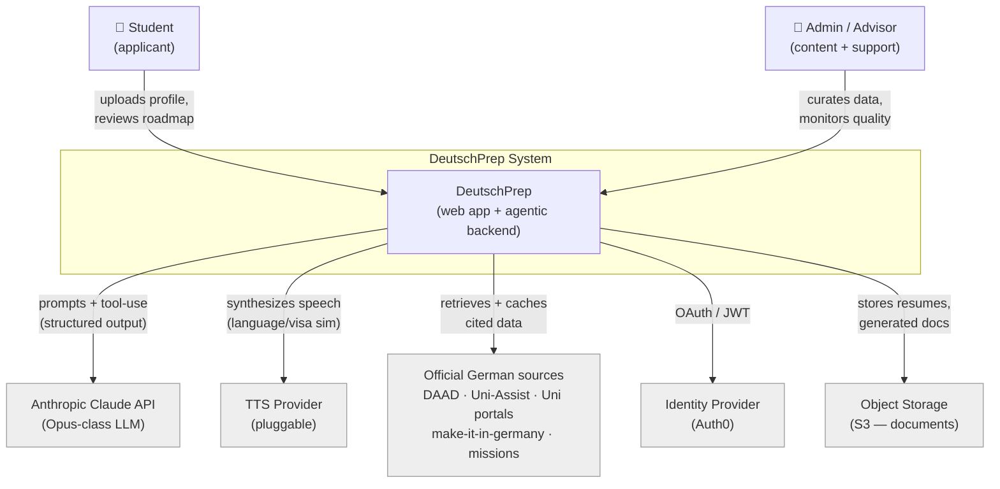
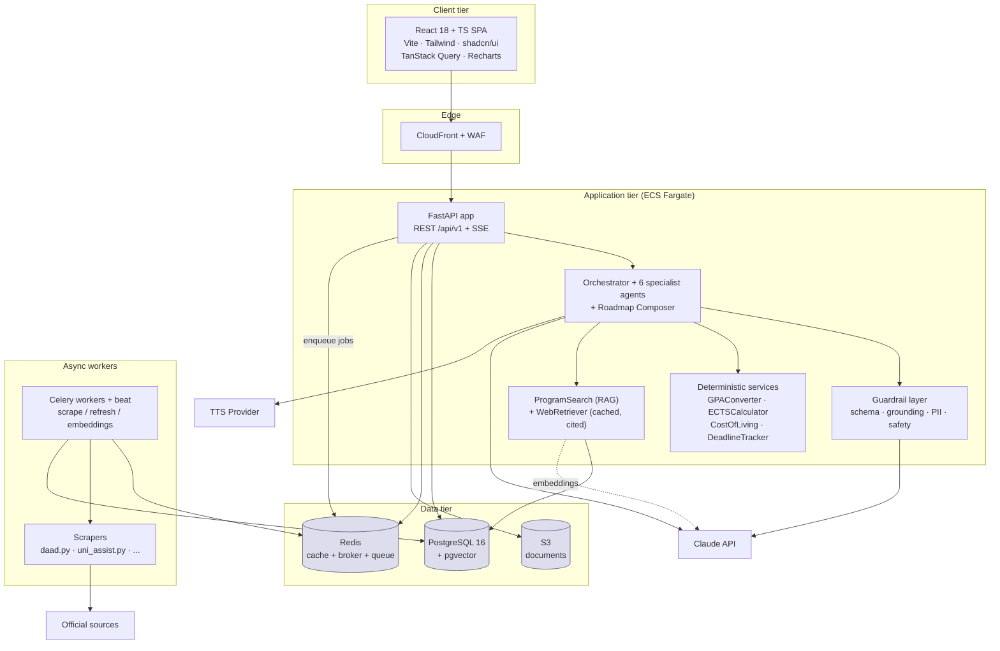
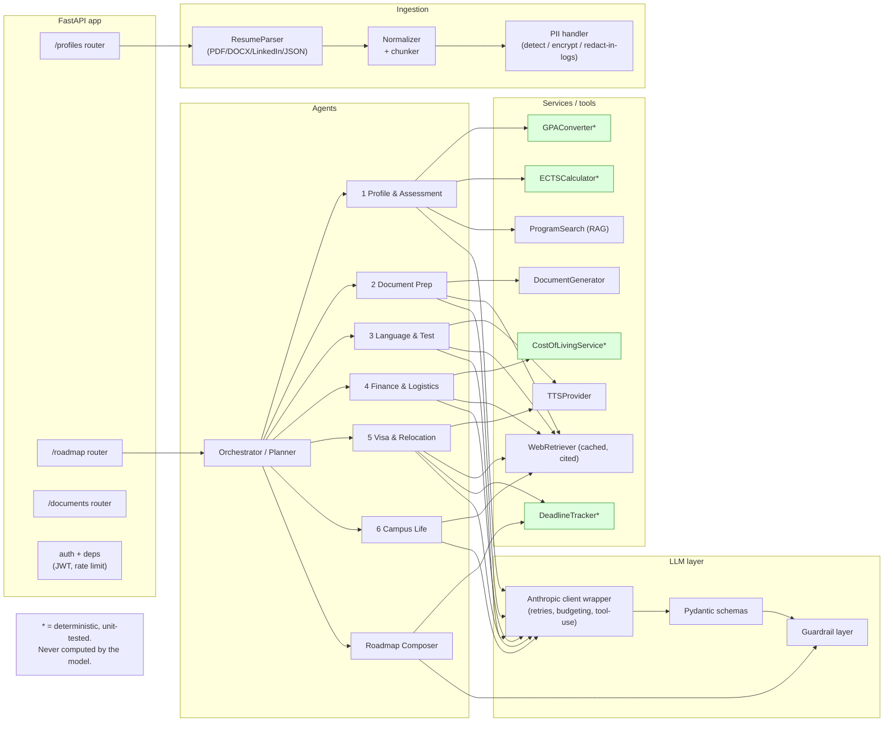
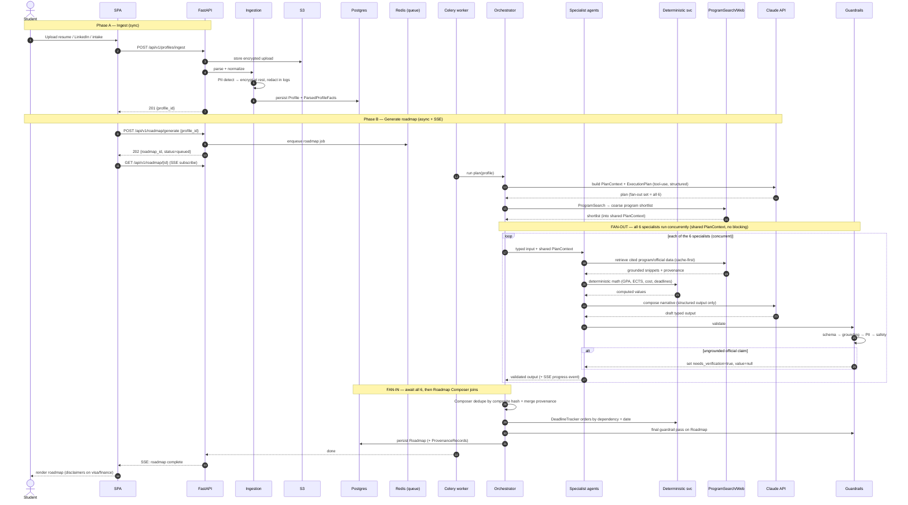
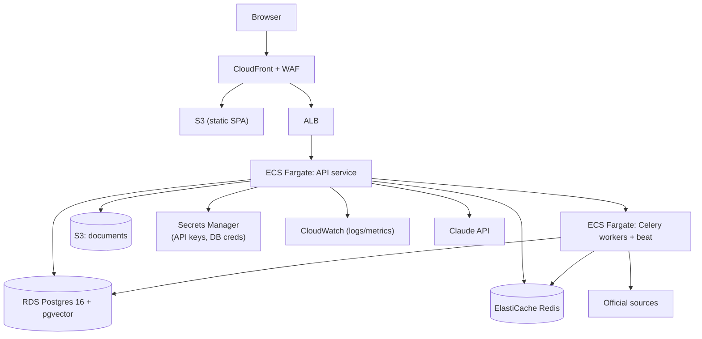

# DeutschPrep — System Architecture

> **Status:** Phase 1 design doc (reviewable). No application code yet.
> **Audience:** engineers, reviewers. Read alongside `agent-workflows.md` and the ADRs.
> Conforms to `CLAUDE.md` §3 (stack), §4 (agentic architecture), §5 (repo layout).

DeutschPrep ingests a student's resume / LinkedIn / intake form and produces a personalized,
provenance-backed roadmap for applying to Master's programs at German public universities. This
document gives a C4-style view (Context → Container → Component) plus the full request lifecycle for
the core path: **ingest profile → generate roadmap**.

The architecture is built around one principle from `CLAUDE.md` §2: **the LLM plans and writes;
deterministic code computes; every official fact carries provenance or is marked
`needs_verification`.**

---

## 1. C4 Level 1 — System Context

| Actor / External | Interaction | Notes |
|---|---|---|
| **Student** | Uploads profile, reviews & acts on roadmap | Primary user; PII owner (GDPR subject) |
| **Admin / Advisor** | Curates scraped data, monitors grounding quality | Internal role |
| **Anthropic Claude API** | Planning + writing via tool-use; returns structured output | Model id from `CLAUDE_MODEL`; never the source of official facts |
| **TTS Provider** | Speech for language module + visa simulator | Behind `TTSProvider` interface (no vendor hardcoding) |
| **Official sources** | DAAD, Uni-Assist, university portals, missions | Only valid origin of official facts; always cited |
| **Identity Provider** | Authentication | **Auth0** (OAuth/JWT) |
| **Object Storage** | Encrypted document storage | S3; PII encrypted at rest |

---

## 2. C4 Level 2 — Container Diagram

| Container | Tech | Responsibility |
|---|---|---|
| **SPA** | React 18 + TS + Vite + Tailwind + shadcn/ui | Dashboard, roadmap timeline, document workspace, simulators |
| **CloudFront + WAF** | AWS | TLS, caching of static assets, edge protection |
| **FastAPI app** | Python 3.12 + Pydantic v2 | REST + SSE; auth; request orchestration entrypoint |
| **Agent layer** | Native Anthropic tool-use (see ADR-0002) | Orchestrator + 6 specialists + Roadmap Composer |
| **Guardrail layer** | Pydantic + custom checks | Runs on every agent output (schema → grounding → PII → safety) |
| **Deterministic services** | Tested Python | All math (GPA, ECTS, cost, deadlines) |
| **RAG / retrieval** | pgvector + httpx | ProgramSearch over DAAD; WebRetriever for live, cited data |
| **Celery workers + beat** | Celery + Redis | Scraping, incremental refresh, embedding generation |
| **PostgreSQL + pgvector** | PG 16 | Relational data + semantic vectors |
| **Redis** | Redis | Cache, Celery broker, response/result cache |
| **S3** | AWS | Encrypted document storage (uploads + generated docs) |

---

## 3. C4 Level 3 — Component View (Application tier)

See `agent-workflows.md` for each agent's typed I/O, scoped tools, and grounding rule.

---

## 4. Request lifecycle — "ingest profile → generate roadmap"

This is the canonical flow. Two phases: **(A) ingest** (synchronous, fast) and **(B) generate**
(async + streamed). Caching, queues, and guardrails are called out inline.

### Where the cross-cutting concerns sit

| Concern | Location in flow | Mechanism |
|---|---|---|
| **Caching** | RAG retrieval (step "cache-first"), HTTP responses, embeddings | Redis (keyed by source URL + content hash); pgvector for semantic reuse |
| **Queue** | Between `POST /roadmap/generate` and worker | Redis broker + Celery; API returns `202` immediately |
| **Streaming** | `GET /roadmap/{id}` | Server-Sent Events; one progress event per specialist |
| **Guardrails** | After *every* agent output + final Roadmap pass | schema → grounding → PII-in-logs → content safety |
| **Provenance** | RAG retrieval + persistence | `ProvenanceRecord {value, source_name, source_url, retrieved_at}` |
| **Determinism** | All math steps | Tested services; never the model |
| **PII** | Ingestion + logging everywhere | Encrypt at rest; redact in logs; GDPR export/delete |
| **Disclaimer** | Render + API response metadata | Attached to all visa/finance/immigration output |

---

## 5. Deployment view (AWS)

- **IaC:** Terraform under `/infra` (`CLAUDE.md` §3).
- **Secrets:** Secrets Manager only — never in code or git. Add billing alerts on the Anthropic key early (per build playbook reality check).
- **Auth:** Auth0 (OAuth/JWT); API validates Auth0-issued JWTs. Decided — see ADR-0001.
- **Local dev:** `docker-compose` with `api`, `postgres+pgvector`, `redis` (Phase 4).

---

## 6. Key cross-references

| Topic | Document |
|---|---|
| Agent I/O, tools, grounding, anti-hallucination | `agent-workflows.md` |
| 30 features → agent → tools → sources → output type | `feature-matrix.md` |
| Stack rationale | `adr/0001-tech-stack.md` |
| Native tool-use vs LangGraph | `adr/0002-agent-orchestration.md` |
| RAG + grounding + provenance contract | `adr/0003-rag-and-grounding.md` |
| Directory tree | `repo-layout.md` |
| Schema + state machine | `data-model.md` (Phase 2) |

---

## 7. Open questions (for review)

1. **Auth provider:** ✅ **Resolved — Auth0** (OAuth/JWT).
2. **Task queue:** ✅ **Resolved — Celery** (+ `beat` for scheduled DAAD/Uni-Assist refresh).
3. **SSE vs WebSocket** for roadmap progress — SSE chosen for simplicity; confirm no bidirectional need.
4. **Embeddings provider** for pgvector: ✅ **Resolved — `BAAI/bge-m3`** (MIT, multilingual, 1024-dim) served locally behind an `EmbeddingProvider` interface. See ADR-0003.
