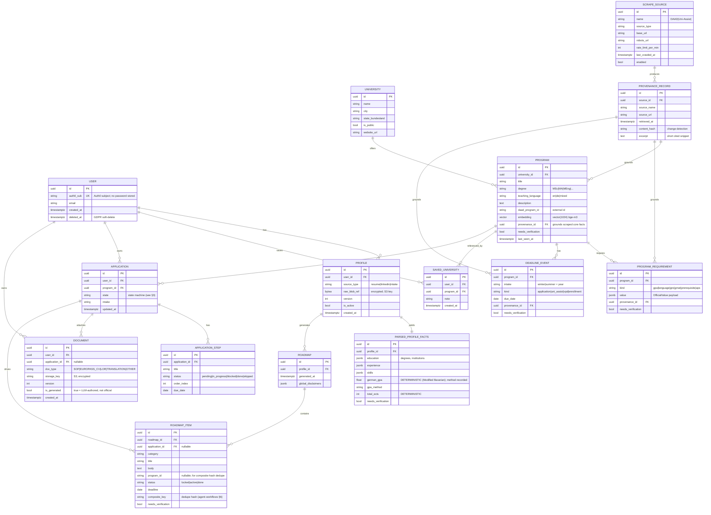
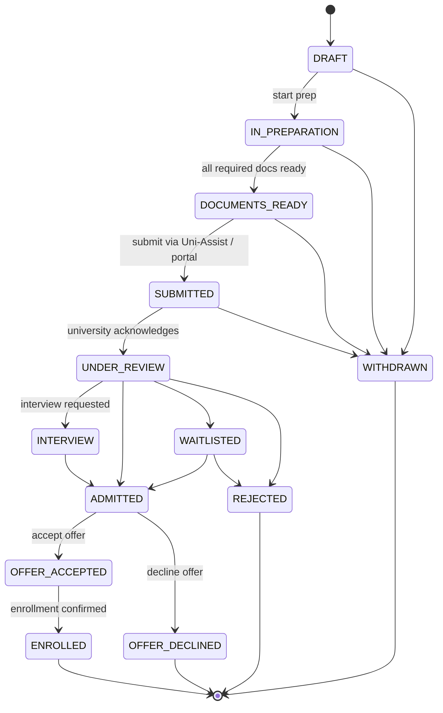
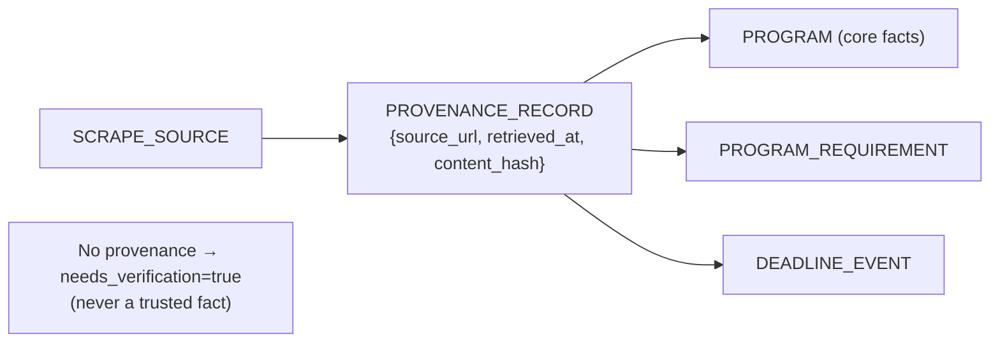

# DeutschPrep — Data Model

> Phase 2 design doc. ER model + application state machine. Implemented in
> `backend/app/models/*.py` (SQLAlchemy 2.0) with the initial Alembic migration. Conforms to
> `CLAUDE.md` §2 (provenance on every official fact) and ADR-0003 (pgvector embedding on `Program`).

---

## 1. Design rules

1. **Provenance is mandatory for official data.** `ProgramRequirement`, `DeadlineEvent`, and the
   scraped core facts on `Program` link a `ProvenanceRecord`. A row holding an official value with
   **no** provenance must set `needs_verification = true` (never persisted as a trusted fact).
2. **PII isolation.** Raw resume/LinkedIn content and parsed personal facts live in
   `Profile` / `ParsedProfileFacts`, encrypted at rest; never logged.
3. **Deterministic vs generated.** Computed values (German GPA, ECTS) are stored with their method;
   generated documents (`Document`) are clearly typed and never treated as official.
4. **Embeddings.** `Program.embedding` is `vector(1024)` (bge-m3, ADR-0003); width asserted at
   startup against `EmbeddingProvider.dimension`.

---

## 2. ER diagram

---

## 3. Application state machine

`Application.state` is an explicit FSM. Transitions are enforced in code (a transition table), not
left to free text — so progress is auditable and the roadmap can compute "what's next."

### Transition table (the allowed edges; anything else is rejected)

| From | Allowed → To |
|---|---|
| `DRAFT` | `IN_PREPARATION`, `WITHDRAWN` |
| `IN_PREPARATION` | `DOCUMENTS_READY`, `WITHDRAWN` |
| `DOCUMENTS_READY` | `SUBMITTED`, `WITHDRAWN` |
| `SUBMITTED` | `UNDER_REVIEW`, `WITHDRAWN` |
| `UNDER_REVIEW` | `INTERVIEW`, `ADMITTED`, `WAITLISTED`, `REJECTED` |
| `INTERVIEW` | `ADMITTED`, `REJECTED` |
| `WAITLISTED` | `ADMITTED`, `REJECTED` |
| `ADMITTED` | `OFFER_ACCEPTED`, `OFFER_DECLINED` |
| `OFFER_ACCEPTED` | `ENROLLED` |
| `REJECTED`, `OFFER_DECLINED`, `ENROLLED`, `WITHDRAWN` | *(terminal)* |

`ApplicationStep.status` is a simpler lifecycle: `pending → in_progress → done`, with side-paths
`in_progress → blocked → in_progress` and `pending → skipped`.

---

## 4. Provenance & grounding (how it maps to §2 rules)

- One `ProvenanceRecord` per scraped row; `content_hash` powers incremental refresh
  (`data-pipeline.md`).
- The guardrail layer (`agent-workflows.md` §10) reads `needs_verification` when composing the
  roadmap and surfaces a UI badge + disclaimer.

---

## 5. Indexing notes

| Table | Index | Why |
|---|---|---|
| `program` | `ivfflat (embedding vector_cosine_ops)` | ANN semantic search (ProgramSearch) |
| `program` | btree `(daad_program_id)`, `(university_id)` | upsert + joins |
| `deadline_event` | btree `(program_id, intake, kind)` | deadline lookups |
| `application` | btree `(user_id, state)` | dashboard queries |
| `provenance_record` | btree `(source_url, content_hash)` | change detection / dedupe |
| `roadmap_item` | btree `(roadmap_id, composite_key)` | dedupe enforcement |

> pgvector ANN indexes support ≤2000 dims; bge-m3's 1024 fits comfortably (a reason it was chosen
> over NV-Embed-v2's 4096 — ADR-0003).

---

## 6. Open questions (for review)

1. **Profile versioning:** keep N historical `Profile` versions (current design) or overwrite? Affects GDPR export scope.
2. **Requirement value shape:** `ProgramRequirement.value` as flexible `jsonb` (current) vs typed sub-tables per `kind`. JSONB is simpler now; revisit if query patterns demand typing.
3. **Soft vs hard delete** for GDPR: `deleted_at` soft-delete + scheduled purge job — confirm retention window.
