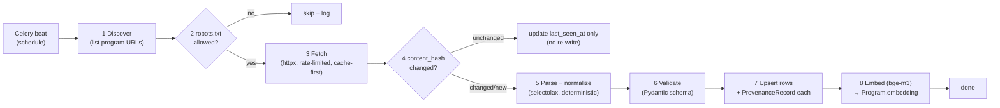
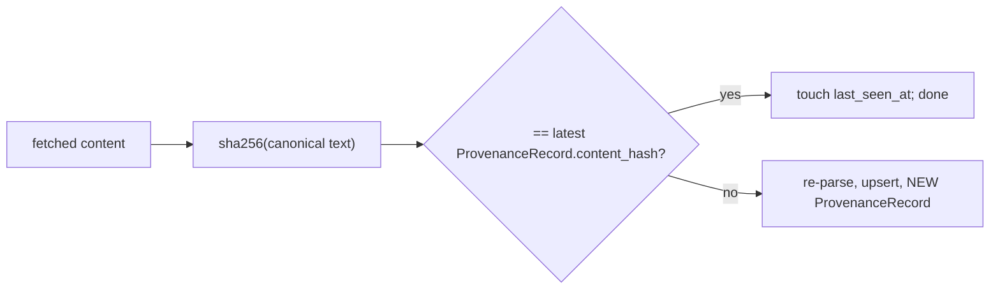

# DeutschPrep — Data Pipeline (Scraping & Refresh)

> Phase 2 design doc. How DAAD program data (and later Uni-Assist / university portals) is fetched,
> normalized, grounded with provenance, embedded, and kept fresh. Reference implementation:
> `backend/app/scrapers/daad.py` (tested vertical slice). Conforms to `CLAUDE.md` §2 (provenance,
> never fabricate) and §3 (Celery, httpx, selectolax, Playwright only for JS portals).

---

## 1. Principles

1. **Prefer official / open data.** DAAD publishes the *International Programmes in Germany*
   database; prefer its structured endpoints over HTML scraping wherever available. HTML parse is
   the documented fallback.
2. **Provenance per row.** Every normalized official value is written with a `ProvenanceRecord`
   (`source_url`, `retrieved_at`, `content_hash`). No unsourced official data is ever persisted.
3. **Deterministic transforms.** Parsing/normalization are pure functions of input bytes → unit
   tested with **recorded fixtures**; no live network in tests.
4. **Be a good citizen.** Respect `robots.txt` + crawl-delay, rate-limit per source, cache
   aggressively, and back off on errors.

---

## 2. Pipeline stages



| Stage | Detail |
|---|---|
| 1 Discover | Enumerate program URLs/IDs from the source's index/API |
| 2 robots.txt | `urllib.robotparser`; honor `Disallow` + `Crawl-delay`; cache robots per source |
| 3 Fetch | `httpx` with timeout + retry/backoff; **cache-first** (Redis, key = `url`); Playwright only if the portal is JS-rendered |
| 4 Change detection | `content_hash = sha256(canonical text)`; compare to last `ProvenanceRecord`; skip unchanged |
| 5 Parse | `selectolax` (fast) → normalized DTO; pure function (testable) |
| 6 Validate | Pydantic `ScrapedProgram`; reject malformed; fields that can't be grounded → `needs_verification` |
| 7 Persist | Upsert `University`/`Program`/`ProgramRequirement`/`DeadlineEvent`; write one `ProvenanceRecord` per official row |
| 8 Embed | Celery task: bge-m3 over `title + description` → `Program.embedding` (vector 1024) |

---

## 3. Scheduling (Celery beat)

| Job | Cadence | Purpose |
|---|---|---|
| `refresh_daad_index` | daily | Discover new/removed programs |
| `refresh_program_detail` | weekly (staggered) | Re-fetch detail pages; change-detect |
| `refresh_deadlines` | daily in season | Deadlines move fast near intake windows |
| `embed_pending_programs` | every 15 min | Embed programs whose text changed |
| `prune_stale` | weekly | Flag programs not `last_seen_at` in N cycles |

Jobs are staggered and rate-limited so a refresh never bursts a source.

---

## 4. Rate limiting & robots.txt

- **Per-source limit:** `ScrapeSource.rate_limit_per_min`; a token-bucket / min-interval gate in the
  worker enforces it (injectable clock → testable without sleeping).
- **robots.txt:** fetched once per cycle, cached; `Crawl-delay` respected as a floor on the interval.
- **Backoff:** exponential on 429/5xx; a source that repeatedly errors is disabled (`enabled=false`)
  and surfaced to admins.

---

## 5. Change detection & incremental refresh



Canonicalization (whitespace-collapse, strip volatile markup) keeps the hash stable against trivial
page churn, so we only re-write and re-embed on **real** content changes.

---

## 6. Provenance capture (the non-negotiable)

Each persisted official value links a `ProvenanceRecord`:

```python
ProvenanceRecord(
    source_id=daad_source.id,
    source_name="DAAD",
    source_url=program_url,
    retrieved_at=now,                 # injected clock (deterministic in tests)
    content_hash=sha256(canonical),
    excerpt=short_cited_snippet,
)
```

If a required official value is missing/unparseable, the row is written with
`needs_verification=true` and **no fabricated value** — the guardrail layer + UI surface it
(`agent-workflows.md` §8).

---

## 7. Failure handling

| Failure | Handling |
|---|---|
| Network/timeout | retry w/ backoff; on exhaustion, keep last good row, log, alert |
| Parse error | skip row, record `needs_verification`, emit metric; never write garbage |
| Schema invalid | reject at Pydantic boundary; quarantine raw payload for inspection |
| Source layout change | selector mismatch → 0 rows → alarm (sudden drop guard) |
| robots disallows | skip + log; never bypass |

---

## 8. Reference scraper (vertical slice)

`backend/app/scrapers/daad.py` implements stages 3–6 for one DAAD listing:

- Injectable `Fetcher` (httpx in prod; a recorded fixture in tests) → **no live network in tests**.
- `parse_programs(html, *, source_url, now)` → `list[ScrapedProgram]` (pure, deterministic).
- Each program carries its `ScrapedProvenance` (`source_url`, `content_hash`, `retrieved_at`).
- Tested by `backend/tests/test_daad_scraper.py` against `fixtures/daad_sample.html`.

> ⚠️ The CSS selectors in the reference scraper are written against the **recorded fixture** and are
> **illustrative**. Before production, validate them against the live DAAD structure (or switch to
> the DAAD structured API). Until validated, treat live-scraped values as `needs_verification`.

---

## 9. Open questions (for review)

1. **DAAD structured API vs HTML:** confirm the open-data endpoint's availability/terms; if usable, it becomes the primary path and HTML the fallback.
2. **Playwright scope:** which portals are JS-rendered enough to need it? (Adds cost; keep minimal.)
3. **Embedding backfill:** batch size / GPU vs CPU for `embed_pending_programs` at scale.
